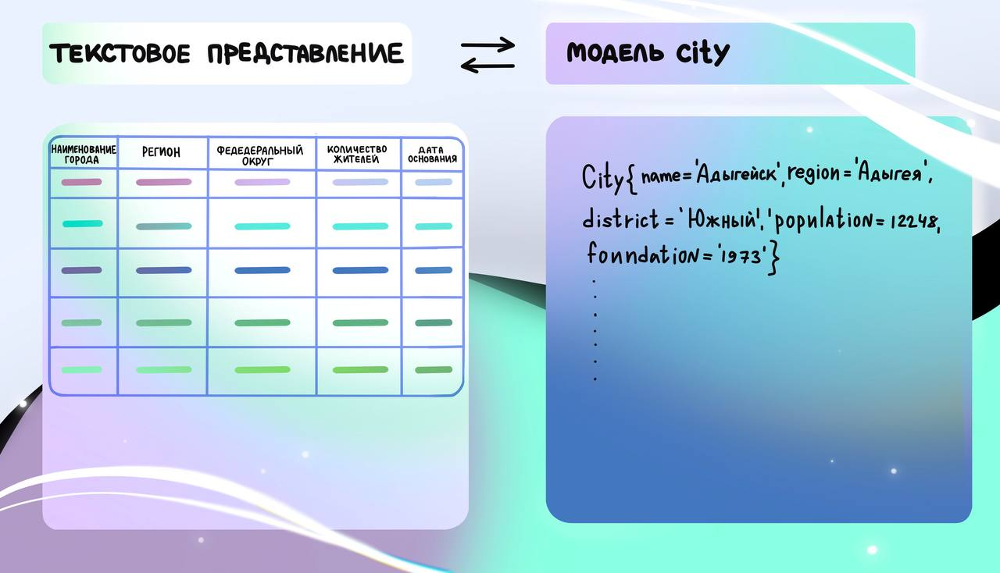

Справочник городов России
===============================
Реализация проекта по загрузке и обработке справочника городов России
в рамках **виртуальной стажировки** одного из крупнейших B2B-сервисов
[СберБизнес](https://v.preactum.ru/stazhirovki/sberbank-java-razrabotka/).
**Справочник представлен в текстовом виде** и состоит из следующих полей:
- Порядковый номер записи справочника;
- Наименование города;
- Регион;
- Федеральный округ;
- Количество жителей;
- Дата основания или первое упоминание.
----

## Задание
### Загрузка справочника городов России
Необходимо реализовать класс Main, используя java.util.Scanner,
прочесть информацию из текстового представления справочника и разложить данные в модель City с полями:
- name – наименование города;
- region – регион;
- district – федеральный округ;
- population – количество жителей города;
- foundation – дата основания или первое упоминание.

> Пример полученного результата:
> 

### Сортировка данных справочника
- Сортировка списка городов по наименованию в алфавитном порядке по убыванию без учета регистра;
- Сортировка списка городов по федеральному округу и наименованию города 
  внутри каждого федерального округа в алфавитном порядке по убыванию с учетом регистра;

Вывести полученный список объектов City в консоль.
При реализации сортировки нужно обратить внимание на возможные варианты реализации:
Comparator, lambda-выражения.

### Поиск города с наибольшим количеством жителей
Необходимо преобразовать список городов в массив. 
А затем путем перебора массива найти индекс элемента и значение с наибольшим количеством жителей города.

> Пример полученного результата:
> 

### Поиск количества городов в разрезе регионов
Реализовать поиск количества городов в разрезе регионов. 
Необходимо определить количество городов в каждом регионе.

> Пример полученного результата:
>* Вологодская область - 15
>* Татарстан - 22
>* Хабаровский край – 7
>* ...
----

## Реализация
Решение этой задачи – комплексный процесс и состоит из 4 этапов:

>* Загрузка справочника городов России;
>* Реализация нескольких вариантов сортировки данных справочника;
>* Поиск города с наибольшим количеством жителей;
>* Поиск количества городов в разрезе регионов.

### Запуск приложения
Требует установки:
- [JDK](https://www.oracle.com/java/technologies/downloads/#java17) 17+
- [Git](https://git-scm.com/)

Введите команды в командную строку:
```
git clone https://github.com/vladislav1is/cities-directory.git
cd cities-directory
```
----